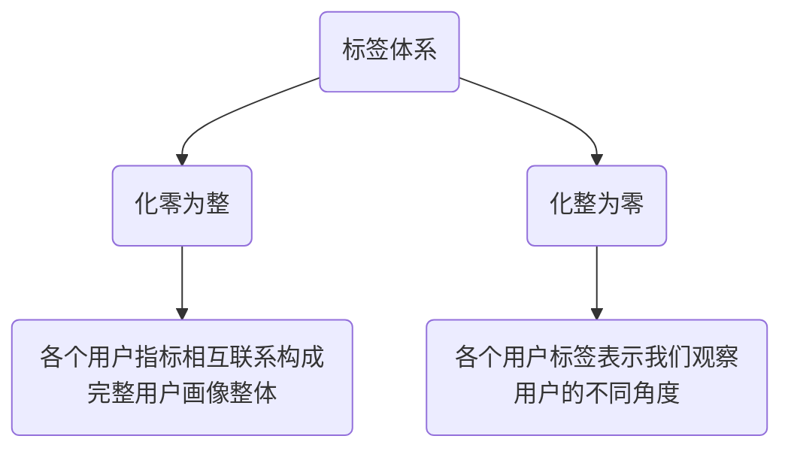

## GrowingIO学习指南

### 1 GrowingIO咨询服务

博客资源：

​	[GrowingIO 全新咨询服务发布：5 年、400 次交付，用产品+服务为企业落地增长](https://blog.growingio.com/growth/473)

PPT资源：

​	[指标体系搭建咨询服务](https://growingio.feishu.cn/file/boxcn7EqL8dLvt0rshkH7KdUinb)


#### 1.1 GrowingIO四类咨询服务

##### 1.1.1 A类服务-规划

帮助客户建立数据驱动意识，构建业务数据体系，发现增长问题与机会

**A类【数据规划】的要点：OSM-数据化战略指标体系&D-UJM数据化用户生命旅程**，并回答下列问题：

* 企业是否存在增长？是真的有效增长吗？
* 每个增长目标都有业务支撑吗？（员工/资源是否都放在了关键业务上？）
* 用户旅程是否都体验到了你最好的产品和服务？

其中，OSM是[目标-策略-度量]，以电商行业为例，最上层的核心目标是提升GMV，拆解为用户数、转化率、客单价，这就是二级目标。细分下去可以拆解为一系列策略支撑和可衡量的指标体系


OSM可以使高层思考现阶段的最重要目标是什么，哪些业务承载这些目标；而业务部门可以通过UJM，将公司目标、策略与业务流程快速耦合在一起，最终形成一个清晰、明确的数据采集体系，减少不必要的数据采集

##### 1.1.2 B类服务-诊断

帮助客户通过归因分析查找增长瓶颈，增长杠杆洞察发展机会，并提出解决方案与策略

**B类【数据诊断】的要点：围绕五大模块，三大体系分析增长困境**，并回答下列问题：

* 看到了问题，那么问题原因是什么？
* 找到了机会，但如何抓住机会实现增长？
* 优化哪些模块，采取什么措施能够带来增长？

GrowingIO对应梳理出的<font color=backorange>**五大模块**</font>、<font color=blackorange>**三大体系**</font>。五大模块对应RARRA增长模型（是海盗模型的升级版）适合互联网属性相对成熟的公司，三大体系对应产品、运营、市场营销三个团队适合传统企业转型互联网的公司。


五大模块中：

* **留存全景**：协助客户解决如何调动各功能模块提高老用户留存的问题
* **激活时刻**：帮助客户降低产品使用门槛，提高新用户激活和沉睡用户召回问题
* **裂变大师**：通过优化客户复购和分享策略与拆解运营活动问题，提高老带新比例降低获客成本
* **转化杠杆**：利用用户行为分分群研究，找到驱动业务增长的魔法数字，确定撬点，集中资源撬动业务增长
* **获客矩阵**：配合当前线上/线下全景流量场景，打通APP、小程序矩阵、广告投放、H5分享、线下扫码等多种渠道数据和获客行为，实现拉新效果最大化

##### 1.1.3 C类服务-驱动

帮助客户实现实现数据策略的落地、实操和复盘

**C类【数据驱动】的要点：驱动企业实现持续的增长，不断迭代升级**，并回答下列问题：

* 产品如何**升级**？运营如何**优化**？
* 如何实现产品持续的**迭代升级**，而不仅仅只是一次单点的优化动作？


用数据驱动产品，用数据驱动运营，用数据驱动投放，实现<font color=FF6133>**精准迭代，精准运营，精准投放**</font>

**最有价值的数据是用户行为**，而不是用户属性数据，用户何时留资、什么时候评论、从哪里点击商品加购、最终下单、分享、转化

​								                               		<FONT COLOR=RED>**数据驱动最重要的能力是连续迭代!!!**</FONT>

##### 1.1.4 D类服务-沉淀

**D类服务的要点：行为数据+业务数据融合**

在增长的成功经验下，GrowingIO 帮助企业做好数据沉淀。将用户行为和业务数据的打通、将不同系统的用户数据汇集到统一的平台，实现自有业务场景下的用户画像、结合第三方的用户标签，为智能化用户运营和管理奠定基础

#### 1.2 GrowingIO咨询服务流程

##### 1.2.1 SAAS业务


##### 1.2.2 OP业务

###### OP业务服务概览


###### OP业务服务流程

* 方案期

  

* 实施期

  

* 交付期

  


### 2 OSM × UJM ×场景化

PPT资源

​	[企业不同阶段的数据指标体系搭建思路](https://files.growingio.com/activity/webinar/ppt/GrowingIO%E5%A2%9E%E9%95%BF%E5%85%AC%E5%BC%80%E8%AF%BE%E7%AC%AC46%E6%9C%9F-2-%E5%BC%A0%E8%8D%A0%E5%8D%89.pdf)

​	[指标体系搭建咨询服务](https://growingio.feishu.cn/file/boxcn7EqL8dLvt0rshkH7KdUinb)

视频资源

​	[企业不同阶段的数据指标体系搭建思路](https://www.growingio.com/video/webinar-46-2)

#### 2.1 OSM × UJM × 场景化的概念

* **OSM模型**
  * O是目标，以GMV为例，提高GMV就是一级目标，提高用户数、提高转化率、提高客单价是二级目标
  * S是策略，是针对目标所制定的方法，以提高用户数为例，培育/拓展高质量渠道就是策略
  * M是度量，是对策略的数值化度量，以拓宽高质量渠道为例，拉新落地页的跳出，下单转化就是度量值

* **UJM模型**

  UJM是用户旅程地图，即用户在业务中的线上生命旅程，通过梳理用户与产品的接触点、痛点发现机会点

* **场景化**

  去行业化，最常用的20个场景

  

#### 2.2 OSM × UJM × 场景化的耦合

* 电商行业为例

  


### [3 用户流传地图分析方法论与实操](https://blog.growingio.com/growth/544)

#### 3.1 用户流转地图

**<font color=darkgreen>“三张”用户流转地图，从全局到局部再到流程细节，着眼内外循环，定位逐层问题</font>**

* **全域流转地图**

  从全局视角绘制整个地图，涵盖「拉新、促活、留存、变现、推荐」覆盖整个公司的业务线（用户流量在该公司的流动运作情况）

  |                        内容产品·全域                         |                        企采产品·全域                         |
  | :----------------------------------------------------------: | :----------------------------------------------------------: |
  |  |  |

* **平台流转地图**

  基于全局流量地图，下钻到某个业务环节，绘制该业务环节下的平台流传地图，平台流转地图具体又可以细分为下列三种地图

  1 站外渠道：观察平台的流量分发情况，识别异常渠道

  2 平台流转：代入平台APP、小程序、网站等数据评估平台效能

  3 裂变转化：绘制裂变流转地图定位裂变断点

  |                      内容产品-流量分发                       |                      企采产品·流量分发                       |
  | :----------------------------------------------------------: | :----------------------------------------------------------: |
  |  |  |
  | 1>首页高曝低转，搜索低曝高转，后续可以围绕这两个场景绘制局部流转地图；2>从首页下钻，寻找最优或最差流量转化楼层，找到首页流量瓶颈；3>从搜索下钻，看是否存在搜索结果无效，匹配不到关键字等情况，进行针对性优化 | 1>垂媒行业为平台带来巨大流量，加强后续分析看这部分人群的后续转化情况；2>搜索的转化率为30%低于行业50~60%的水准；3>在线客服的转化率高于意向表单，而产品中无任何在线客服引导环节，需重新规划引导路径 |

* 局部流转地图

  根据平台流转地图又可以得到基于功能下钻的局部流转地图和基于日常活动下钻的局部流传地图

  |                      内容产品·局部流转                       |                      企采产品·局部流转                       |
  | :----------------------------------------------------------: | :----------------------------------------------------------: |
  |  |  |
  | 1>付费课详情页的转化率为1.7%远低于行业3~7%的水平，需要进行优化；2>免费课到付费课支付不存在引导路径 | 查看产品参数、浏览促销信息、浏览案例的用户最后的转化率高于平均用户，因此要基于不同的用户行为进行引导留资 |

  |                     内容产品·详情页流转                      |
  | :----------------------------------------------------------: |
  |  |

#### 3.2 绘制流转地图

* **地图五要素**

1 UJM(User Journey Map)横轴    2 流转节点    3 流转线段    4 流转数量    5 流转率


* **绘制四步法**

  **<font color=darkgreen>1 根据业务目标，确定关键结果</font>**

  通过不同业务形态确立目标，并拆解离这个目标最近的关键结果及转化行为

  <font color=darkgreen>**2 结合关键结果，反推高价值行为**</font>

  梳理用户与产品的触点，把用户和产品的触点分为「访问行为」「高价值行为」「关键结果行为」。依据「关键结果行为」倒推用户「高价值行为」，然后再根据用户的「高价值行为」倒推用户的「访问行为」。比如电商的关键结果是下单，往前推就得到加购和购买两个高价值行为，再进一步倒推得到访问行为

  <font color=darkgreen>**3 量化页面表现，排布流转节点**</font>

  根据GrowingIO的ICE模型中的I(Impact 影响力)和C(Confidence 重要性程度)，对上述得出的用户「行为」进行评级，进行合并筛选，形成“岛”（“岛”的要求是不超过10个）

  <font color=darkgreen>**4 套用数据模型，补全流转地图数据**</font>

  「访问行为—高价值行为」阶段的数据主要回答各个页面的流量是从哪里来的，通过 GrowingIO 的事件分析，我们可以很快地找到各个高价值行为动作的前序页面。在「高价值行为—关键行为」阶段，通过漏斗分析便能得到所需数据。


### [4 标签体系搭建理论](https://growingio.feishu.cn/docs/doccnTcwUYCIkxWroRsdI65Ec1v)

#### 4.1 标签体系

用户标签是对某一特征群体的某些特征进行抽象的概括和分类，用户标签所构成的集合就是标签体系（用户画像）



#### 4.2 标签分类与分级

* 从<font color=darkgreen>**数据时效性**</font>可以分为

  1 **静态标签**：长久甚至永远都不会发生改变，比如出生日期、性别等

  2 **动态标签**：存在有效期，需要定期的进行更新，保证标签的有效性，如生命周期、消费能力等

* 从<font color=darkgreen>**数据提取角度**</font>可以分为

  1 **事实标签**：从原始数据提取或加工而来，比如用户的性别、年龄

  2 **规则标签**：从用户行为数据中加工而来，比如用户的生命周期、活跃度、用户价值

  3 **预测标签**：通过数据挖掘，对用户的某些行为数据预测建模得到，比如用户的消费能力，流失概率

* 从<font color=darkgreen>**标签管理角度**</font>可以对标签进行分级

  

#### 4.3 标签体系的搭建

* 标签体系搭建基础：用户属性数据、用户行为数据、用户交易数据、第三方来源数据

* 标签体系搭建原则

  1 **基于业务场景**：不同业务场景对应不同的标签体系，梳理业务流程是搭建标签体系的第一步

  2 **有明确目标**：标签体系的搭建要围绕具体的关键业务目标

  3 **覆盖核心流程**：基于用户UJM模型，标签要涵盖用户的整个生命旅程

  4 **互斥、穷尽**：基于MECE原则，标签体系的搭建要互斥且穷尽

* 标签体系搭建流程

  

* 标签体系的搭建框架

  1 <font color=darkblue>**4P营销**</font>

  

  2 <font color=darkblue>**生命周期**</font>

  

  3 <font color=darkblue>**AARRR**</font>

  

  4  <font color=darkblue>**AIPL**</font>

  ```mermaid
  graph LR;
  	A(Awareness</br>认知)
  	B(Interest</br>兴趣)
  	P(Purchase</br>购买)
  	L(Loyalty</br>忠诚)
  	A-.->B
  	B-.->P
  	P-.->L
  ```

  

  5 <font color=darkblue>**RFM**</font>

  

#### 4.4 标签体系的评估

* 效果评估：对实际业务例如点击率、时长、销售额的提升
* 质量评估：准确率、覆盖率、使用率

#### 4.5 标签体系的应用

* **<font color=darkgreen>基于用户生命旅程的业务应用场景</font>**

  ==A(识别)== —— 如何让用户对于产品产生认知(如何触达用户)

  * **用户识别**：我面向的用户是什么群体？
  * **渠道选择**：我应该从什么渠道进行投放？
  * **广告优化**：我进行投放的内容应该是什么？

  ==I(兴趣)== —— 如何提升用户的兴趣（如何增加用户活跃与留存）

  * **活动优化**：如何优化活动使更多的用户参与进来？
  * **行为分析**：如何分析用户的行为提高用户的活跃与留存？
  * **会员体系**：如何搭建我的会员体系增加用户的留存？

  ==P(购买)== —— 如何让用户产生购买行为

  * **需求分析**：用户购买产品的需求是什么？
  * **产品推荐**：用户未来的购买趋势是什么？便于我给用户更好的推荐？
  * **营销优化**：我该如何设计我的优惠活动使更多用户产生购买行为？

  ==L(忠诚)== —— 如何让用户成为我产品的忠实用户

  * **交易价值识别**：用户是否在我这里进行了多次复购？
  * **社交价值识别**：用户是否为我的产品进行了宣传？

​	   


* 构建**<font color=darkgreen>人-商品-会员-活动-内容</font>**五位一体的指标体系（不太懂这块儿）


### [5 电商标签服务实操流程](https://growingio.feishu.cn/docs/doccnTcwUYCIkxWroRsdI65Ec1v)

#### 5.1 标签诊断

| 体系化                                                       | 规范化                                                       | 产品化                                                       | 场景化                                                       |
| ------------------------------------------------------------ | ------------------------------------------------------------ | ------------------------------------------------------------ | ------------------------------------------------------------ |
| ★当前标签是否进行了有效的分类与分层<br />★新增标签能否合理的归入当前分类 | ★标签计算规则是否切合当前业务<br />★标签数据来源是否可靠<br />★标签质量(覆盖率、准确率)是否过关<br />★标签是否能根据当前业务进行有效迭代 | ★除单用户画像、用户分群外标签是否具备覆盖人群分布等功能<br />★标签的迭代和更改是否便捷 | ★标签是否贴合业务场景需求，涵盖业务流程<br />★标签上线后是否存在有效的业务效果与质量评估 |

#### 5.2 标签设计与优化

标签的设计与优化同样也围绕体系化、规范化、产品化、场景化四个方向展开

##### 5.2.1 体系化

* **标签体系化原则**

  * <font color=darkgreen>**设计体系化**</font>：标签要按照业务场景进行有效的分层分类

    <font color=red>**一级指标要牢记：用户属性标签、用户行为标签、用户交易标签、用户偏好标签、用户价值标签、社交特征标签**</font>

    

  * <font color=darkgreen>**管理体系化**</font>：标签要按照业务需求进行有效的生命周期管理

    

##### 5.2.2 规范化

<font color=red>**规范化主要是对事实标签、规则标签、预测标签这三类标签，进行需求类型确认、需求类型细化、计算口径统一、质量效果评估**</font>

* **事实标签**


* **规则标签**


* **算法标签**


##### 5.2.3 产品化

##### 5.2.4 场景化

#### 5.3 标签落地与评估


------


## 产品培训

### 1 OP产品相关概念

文章资源：[用户模型](https://docs.growingio.com/op/v/2.0/getting-started/basic-concept/user-identifications/)，[数据模型](https://docs.growingio.com/op/v/2.0/getting-started/basic-concept/data-model/)，[属性模型](https://docs.growingio.com/op/v/2.0/getting-started/basic-concept/property-model)，[客户数据平台](https://docs.growingio.com/op/v/2.0/product-manual/customer-data-platform/)

#### 1.1 GIO数据模型

##### 1.1.1 用户模型

* **计算逻辑**

  如果一个设备( 网站应用、APP、小程序 )从未登录过，我们会将该设备识别为一个“用户”，此时gid为设备匿名ID；如果一个设备曾经登录过，我们会将该设备的所有行为归属于它所登录的用户ID，通过登录用户ID来唯一识别一个用户，此时gid为登录ID

* **常见场景**

  * 匿名用户首次登录后，关联用户首次登录前后产生的行为
  * 用户在设备登录后，关联用户登录行为和匿名行为
  * 用户跨应用使用时，关联用户多应用使用行为
  * 多用户使用同一应用时，区分不同用户使用行为

##### 1.1.2 数据模型

* **数据模型分类**

  * 行为模型 Event（访问、页面浏览、埋点、行为）

  * 用户属性模型(UserProps)

    * 用户属性是人的画像信息，可以作为维度对人群进行拆解

    * 包含who(用户标识)、dim(属性名称)、dvalue(属性值)、in_time(更新时间)

    * 通过用户属性模型可以确定某个用户在某个时间点用户“长什么样子”，方便客户更加深入的洞察某类用户

  * 标签模型(Tag)（物品角度与用户角度）

    * 用户标签是组成用户画像的基础描述信息，与用户属性模型的差别在与标签模型是基于GrowingIO计算能力对人进行打标

* **数据表**
  * 行为模型：CARBON.EVENT_LOG
  * 用户属性模型：USER_PROPS
  * 物品模型：CARBON.ITEM
  * 标签模型：TAG_RULE_RESULTS(标签角度)、USER_TAG_RULE_VALUES（用户角度）

##### 1.1.3 属性模型

* **属性模型分类**

  GrowingIO系统中支持三种事物模型，分别为事件模型、物品模型和用户模型，其对应的属性如下：

  | 事物模型 | 属性定义                       |
  | -------- | ------------------------------ |
  | 事件模型 | 预定义属性(系统内置)、事件属性 |
  | 物品模型 | 物品属性                       |
  | 用户模型 | 用户信息(系统内置)、用户属性   |

* **事件-属性-标签**

  .png)

#### 1.2 用户标签模型

文章资源：[用户标签](https://docs.growingio.com/op/v/2.0/product-manual/customer-data-platform/user/user-tags)

##### 1.2.1 标签类别

* 按照业务特征划分

  人口属性标签、交易属性标签、兴趣偏好标签

* 按照创建方式划分

  | 标签分类 | 描述                                               |
  | -------- | -------------------------------------------------- |
  | 属性标签 | 根据企业沉淀的用户信息加工转换生成                 |
  | 计算标签 | 根据用户的行为和特征计算生成                       |
  | 规则标签 | 根据业务经验，人工或半人工通过规则计算生成         |
  | 预测标签 | 大部分依赖算法计算，需要人工参与调参和业务效果验证 |

##### 1.2.2 标签计算模型

* 基础指标值

  对某个事件在某个事件段内的发生次数、发生天数进行总和、平均、累计占比等方式的度量

* 最大值/最小值事件属性

  对某个事件在某个事件段内的发生次数、发生天数进行最大值或最小值的度量

* 首次/末次的事件属性

  返回某个事件在某个时间段的事件属性、距今天数、具体日期

* 列表类的事件属性

  列表类的事件属性可以对用户产生事件的全部事件属性列表作为标签值，对用户打标。指定周期内，某个事件的全部事件属性列表

* 分层标签

  根据用户行为数据将用户分层为低活跃、中活跃、高活跃用户

##### 1.2.3 SQL标签

####  

### 2 客户数据平台

客户数据平台 （Customer Data Platform） 在GrowingIO 中被定义为一个数据中心 (Data Center) 。‌ 所有数据采集 、数据源接入，都会先汇集到客户数据平台，进行统一的数据融合与存储 


#### 2.1数据导入

CPD中的数据可以从以下渠道进行导入

| 导入方式     | 数据源类型                                               |
| ------------ | -------------------------------------------------------- |
| 移动应用     | Android、IOS                                             |
| 小程序应用   | 微信小程序、微信公众号、支付宝、百度、字节跳动、QQ小程序 |
| 网页应用     | JS SDK                                                   |
| 服务端       | JAVA、PHP                                                |
| 历史数据导入 | 用户行为数据、用户属性数据                               |


#### 2.2 预定义指标

预定义指标为GrowingIO默认统计指标，该指标不能编辑和删除。

| 指标名称                | 指标含义                                          | 数据逻辑                                |
| ----------------------- | ------------------------------------------------- | --------------------------------------- |
| 用户量                  | 有访问或行为的独立用户(GID)数量                   | 包含SDK数据和上传数据                   |
| 任意行为                | 有访问或行为的独立用户(GID)                       | 包含SDK数据和上传数据                   |
| 活跃天数                | 当天发生任意行为，为其活跃天数累计1天             | 包含SDK数据和上传数据                   |
| 访问量                  | 用户从进入到离开应用的一系列操作过程称为一个访问  | 仅包含JS\微信小程序\IOS\Android SDK数据 |
| 页面浏览量              | 一定周期内，用户每打开或刷新一个页面就记录一次    | 仅包含JS\微信小程序\IOS\Android SDK数据 |
| 每次访问页面浏览量      | 页面浏览量/访问量，衡量每次访问带来的页面浏览量   | 仅包含JS\微信小程序\IOS\Android SDK数据 |
| 人均访问次数            | 访问量/用户数，衡量每个用户的平均访问次数         | 仅包含JS\微信小程序\IOS\Android SDK数据 |
| 总访问时长(分钟)        | 所有访问的总时长                                  | 仅包含JS\微信小程序\IOS\Android SDK数据 |
| 平均访问时长(分钟)      | 总访问时长/访问量，衡量每次访问的平均时长         | 仅包含JS\微信小程序\IOS\Android SDK数据 |
| 跳出次数                | 访问一个页面就离开的次数，即一次访问只有一个页面  | 仅包含JS\微信小程序\IOS\Android SDK数据 |
| 跳出率                  | 访问一个页面就离开的次数占所有访问的次数          | 仅包含JS\微信小程序\IOS\Android SDK数据 |
| 退出次数                | 用户退出网站/App/小程序的数量                     | 仅包含JS\微信小程序\IOS\Android SDK数据 |
| 退出率                  | 该页面作为访问中最后一个页面次数/该页面访问总次数 | 仅包含JS\微信小程序\IOS\Android SDK数据 |
| 总页面停留时长(分钟)    | 用户在所有页面停留的时长总和                      | 仅包含JS\微信小程序\IOS\Android SDK数据 |
| 平均页面停留时长 (分钟) | 平均每个页面的停留时⻓                            | 仅包含JS\微信小程序\IOS\Android SDK数据 |

#### 2.4  预定义维度

预定义维度也称预定义属性，为iOS、Android、JS和微信小程序SDK默认采集信息，该信息仅能查看和使用，不能编辑和删除。

广告的预定义指标有==广告来源==，==广告名称==、==广告内容==、==广告关键字==、==广告媒介==，通过对上述维度的拆解，我们可以发现优化广告投放渠道，优化广告内容、关键字，并识别最有效的广告媒介

| 名称          | 含义                                                         | 示例                             |
| ------------- | ------------------------------------------------------------ | -------------------------------- |
| 事件          | 事件发生的时间（日期）                                       | 2019-01-01                       |
| 域名          | Web端理解为域名，App理解为应用的包名，小程序理解为AppID      | www.growingio.com                |
| 应用平台端    | 即应用是指什么类型的终端                                     | Web、iOS、Android、MinP、H5      |
| App版本       | App和小程序的版本号                                          | 5.1、5.2                         |
| 访问来源      | 站外流量访问，直接搜索访问                                   | m.baidu.com、直接访问、微信-其他 |
| 一级访问来源  | 直接访问、搜索引擎、社交媒体、外部链接                       |                                  |
| 搜索词        | 用户从搜索引擎进入网站所使用的搜索词                         | GrowingIO、热力图、百度自然流量  |
| 广告来源      | utm_source，标识投放的广告来源                               | google、baidu、toutiao           |
| 广告名称      | utm_campaign，标识投放产品的具体广告系列名称、标语、促销代码等 | springsale                       |
| 广告内容      | utm_content，用于区分相似内容或同一广告内的链接              | textlink                         |
| 广告关键字    | utm_term，标识投放的付费搜索关键字                           | running+shose                    |
| 广告媒介      | utm_medium，标识投放的广告媒介或营销媒介                     | cpc、banner、EDM                 |
| 自定义App渠道 | 针对安卓用户设置的分包渠道                                   | 华为、小米、vivo、oppo           |
| 城市          | 用户访问应用时所在的城市                                     | 北京、上海、广东、浙江           |
| 地区          | 用户访问应用时所在的国内省级以上行政区，以及国外地区         | 北京、上海、广东、浙江           |
| 国家代码      | 用户所在的国家的英文缩写                                     | CN、US、JP、SG                   |
| 国家名称      | 用户所在的国家的名称                                         | 中国、美国、英国、新加坡         |
| 浏览器        | 用户所用浏览器的类型                                         | Chrome、sougou、Safari、IE       |
| 浏览器版本    | 同浏览器，但是会按照不同的版本进行区分                       | Chrome 47.0.2526                 |
| 操作系统      | 用户所使用的操作系统                                         | Mac OS X、Android、weixin-iOS    |
| 操作系统版本  | 同操作系统但是会按照不同的版本进行区分                       | Android 4.0、Windows 8           |
| 屏幕大小      | Web端是窗口大小，移动端是屏幕大小                            | 640×360、1920×1080               |
| 操作系统语言  | 统计不同的操作系统语言的使用情况                             | 简体中文、英文、繁体中文         |
| 设备品牌      | 设备的品牌                                                   | Apple、xiaomi、huawei、oppo      |
| 设备型号      | 设备的具体机型                                               | iPhone X、iPhone 8 、OPPO R11    |
| 设备类型      | 设备的类型                                                   | 手机、平板电脑                   |
| 设备方向      | 用户访问时使用的设备方向                                     | 竖直、横向                       |


### 3 产品分析平台

**<font size=5 color=darkblue>视图介绍</font>**

| 视图     | 视图功效                                                     |
| -------- | ------------------------------------------------------------ |
| 线图     | 可以用于观察一个或多个数据指标连续变化的趋势，也可以根据需要与之前周期进行同比数据分析 |
| 纵向柱图 | 纵向柱图主要用于分析和对比各类别之间的数值大小 ，其中横轴表示需要对比的分类维度，纵轴表示相应的指标数值 |
| 横向柱图 | 横向柱图是一种频数图，主要用于观察某个指标在某个维度上的分布 |
| 表格     | 表格是信息最密集的呈现方式，可以同时分析多指标和多维度的数据 |
| 气泡图   | 气泡图主要是分析多个事件在一个维度上之间的关系。比如油耗，速度，价格和不同的车型之间的关系 |

#### 3.1 分析模型

##### 3.1.1 [漏斗分析](https://docs.growingio.com/op/product-manual/product-analysis/funnel)

漏斗是有序的，漏斗分析是一套流程式的数据分析模型，通过将用户行为起始的各个行为节为分析模型节点，来衡量每个节点的转化效果，是转化分析的重要工具

核心功能包括：

* 漏斗步骤自定义，展示每步人数、转化率，以及总转化率
* 自定义时间区间，查看特定时间内的相关漏斗转化率趋势
* 提供属性维度拆分，维度包括但不限于：访问来源、浏览器、浏览器版本、操作系统、城市、地区、国家名称、广告来源、广告名称、广告内容，广告关键字，广告媒介，以及20个自定义的用户属性维度
* 支持选择不同分群用户，进行漏斗步骤的对比

漏斗分析要区分进入时间和转化周期

* 进入时间：时间是指用户进入漏斗的时间范围，也就是完成漏斗第一步的时间。默认是“过去 14 天”，可以在此处切换成“今天”或者过去的一段时间。此处时间限定的是漏斗第一步，也就是用户进入转化漏斗的时间范围
* 转化周期：指用户从漏斗第一步到完成之后每一步需要在转化周期时长内完成记作转化，否则记作流失。默认是1 天，最长 90 天

##### 3.1.2 归因分析

归因分析是一种将销售功劳或者转化功劳，按一种或者一组分配规则，按劳分配给转化路径中不同接触点的数据分析模型。可以帮助我们深入了解用户转化路劲，找到广告或渠道对用户转化的促成关系。通过归因分析找到最具价值的和最具潜力的接触点，节省营销投放费用的同时更好的提升用户转化。

常见的归因模型有以下四种：

* 首次归因：在回溯期内给首次触点的转化功劳分配100%，给其余触点分配0%
* 最终归因：在回溯期内给最后一次触点的转化功劳分配100%，给其余触点分配0%
* 线性归因：在回溯期内，一次转化被各触点平均分配。
* 位置归因：在回溯期内，给用户的首末次触点分配40%，给其余中间位平均分配20%

##### 3.1.3 事件流分析

事件流分析是分析用户在产品内流转行为的方法，事件流分析通过桑基图展现，可以了解用户在起始行为之后的流向，也可以了解转化的用户是如何一步步完成转化的，以此判断用户的去向是否符合预设路径

通过事件流分析可以回答以下问题：

* 用户行为路径是否与预设的路劲一致
* 产品迭代后，用户行为路劲是否有变化
* 产品的流失用户去了哪里？为什么会流失？
* 产品设计是否给用户带来了最佳体验？

##### 3.1.4 [留存分析](https://docs.growingio.com/op/product-manual/product-analysis/retention)

留存分析是衡量产品是否对用户有持续吸引力以及用户粘性的重要数据分析模型，可以通过表格和线图呈现。留存表格展示了用户的留存详情，留存线图可以观测随着时间推移，用户留存率的衰减情况。

留存率的一般口径定义是目标用户在一段时间内回到网站/APP中完成某个行为的比例

#### 3.1 流程画布

流程画布可以帮助运营/业务人员定制复杂的用户旅程和营销策略，进行多波次、多轮次的用户触达活动。

创建流程画布：https://docs.growingio.com/op/product-manual/mp/process/create-process

#### 3.3 用户运营

用户运营可以帮助企业营销人员实现对用户的自动化、个性化、多元化的触达、并通过实时监测触达转化数据，提升关键业务指标。通过用户运营，客户可以选择精准的目标受众，在合适时间，通过正确的触达渠道给用户传递感兴趣或所需的内容

##### 3.3.1 微信触达

微信触达是专门针对微信场景的运营模块，GIO拥有比公众平台更强大的精细化触达和分析能力，满足多元化的业务需求

服务号模板消息：https://docs.growingio.com/op/product-manual/mp/mp/wei-xin-chu-da/fu-wu-hao-mo-ban-xiao-xi

##### 3.3.2 [webhook](https://docs.growingio.com/op/product-manual/mp/mp/webhook)

##### 3.3.3 弹窗

弹窗是指打开网页、移动应用等的时候自动弹出的窗口。使用 GrowingIO 可以快速实现给**特定的人群**（基于用户分群），发送不同内容弹窗的需求，以**提高运营效率和产品效果**。

* 创建弹窗：https://docs.growingio.com/op/product-manual/mp/mp/popup/create

* 弹窗数据：https://docs.growingio.com/op/product-manual/mp/mp/popup/detials

* 弹窗管理：https://docs.growingio.com/op/product-manual/mp/mp/popup/manage
* A/Btest：https://docs.growingio.com/op/product-manual/mp/mp/popup/ab-experiment

##### 3.3.4 资源位

GIO 资源位目前只支持轮播位或Banner。Banner 位可以同时放置多张图片素材，采用轮播的方式，每隔几秒钟，系统会自动切换下一张，循环播放（也称为轮播图），也可以只放一张图片作为促销/广告等活动的入口。

* 创建资源位：https://docs.growingio.com/op/product-manual/mp/mp/banner/create
* 轮播图设置：https://docs.growingio.com/op/product-manual/mp/mp/banner/setting

##### 3.3.5 [推送](https://docs.growingio.com/op/product-manual/mp/mp/tui-song/)

##### 3.3.6 [短信](https://docs.growingio.com/op/product-manual/mp/mp/duan-xin/chuang-lan-duan-xin)

### 4 SaaS平台

SaaS和OP是两种不同的服务器部署方式，GrowingIO的SaaS是指UBA+MA，OP产品则是CDP+UBA+MA，与OP不同的是SaaS可以去做更多的获客分析

