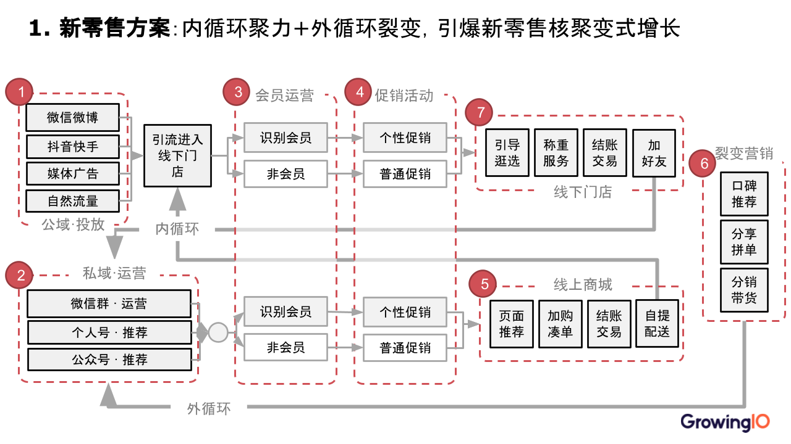

# 高客单价全域流转

## 高客单价行业全域流转地图

SaaS行业的全域流转地图绘制流程如下：

1. <mark style="color:blue;">**流量投放**</mark>：从公域（户外媒体、博览会、行业展会、论坛沙龙、产品发布会、客户谢答会、财富中心、白皮书/案例）和私域（泛媒投放、SEO/M关键字搜索、垂直媒体、KOL、微博抖音、微信公众号、KOC、企微/个人号）两个方面完成投流
2. <mark style="color:blue;">**流量分发**</mark>：投流吸引流量之后，将流量分发到公司官网、APP、小程序、微网站
3. <mark style="color:blue;">**流量运营**</mark>：流量运营这里又可以划分为内容运营、用户运营&#x20;
   * <mark style="color:orange;">**内容运营**</mark>：在公司流量分发页发布相关文章引起用户兴趣，引发用户后续的留资
   * <mark style="color:orange;">**用户运营**</mark>：用户关注、注册、留资之后，客服接入完成相关的销售跟踪，进一步引导用户下单
4. <mark style="color:blue;">**流量变现**</mark>：客服将转化到的线索交给销售团队，CSM根据用户信息完成销售，实现流量变现，并将相关用户流量分发到销售支持模块，促使用户进一步续约和加购，完成内循环留资优化
5. <mark style="color:blue;">**流量裂变**</mark>：客户购买软件后，成为案例，进行外循环投流，实现外循销转提升

## 高客单价行业优化方案

### 方案步骤

#### 1 投放倍增方案

流量投放：通过TGI+智能投放+落地页+KOC公众号挖掘，优化线上公域私域投放，实现精准引流

#### 2 基于算法模型的官网全面提效方案

流量分发：对不同来源渠道，不同广告链接进入的用户，通过智能算法，优化用户的兴趣培养，留资转化

#### 3 线索培育转化倍增方案

新用户流量变现：对留资用户利用社群工具以及销售人员的后续跟进，促使用户向付费转化

#### 4 用户活跃度倍增方案

流量运营：对已购买产品的老用户搭建活跃度与流失模型，实现客户活跃度的精准培育和流失的精准预测

#### 5 增购培育方案

老用户流量变现：根据用户在产品的使用情况，向用户推荐咨询服务或者产品加购，实现老用户的复购

#### 6 裂变倍增方案

流量裂变：用户成为付费用户后，通过裂变活动策略以及裂变达人策略，线上优化公域投流，优化裂变

#### 7 线下客户激活倍增方案

流量裂变：通过直播代运营以及线下会，完成线下客户的裂变

.png>)

### 方案总结

本质上优化方案是从两条线出发的，一条是新用户，一条是老用户，两条线都从流量投放、流量分发、流量运营、流量转化、流量裂变几个维度进行了优化。

<mark style="color:blue;">**在新用户方面：**</mark>

优化流量投放 --> 流量进行个性化分发  --> 引导用户留资转化 --> 销售跟进完成付费 --> 付费用户裂变

<mark style="color:blue;">**老用户方面：**</mark>

建立活跃度与流失模型 --> 根据老用户情况提供加购服务 --> 销售跟进完成续费 --> 老用户付费裂变
