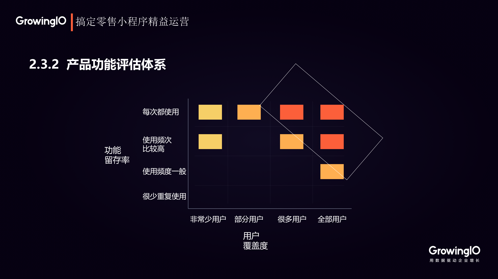

# 零售小程序的“人、货、场”分析

运营的本质是链接用户与商品，实现用户与商品的匹配，从而实现价值最大化

运营的分类有很多，用户运营、产品运营、社区运营、社群运营等，但是本质上都可以从人、货、场三个方面去归类整理

**“人”是用户运营，“货”是商品运营，“场”是产品运营**

## 一、人——用户运营体系的五要素

传统的用户运营中，最常用的方式就是用户推送，短信、弹窗等。但是这种粗犷的推送方式对于小程序来说是不适用的，一是会对用户造成打扰，二是小程序收到的监管较为严格，过多的推送会导致小程序封禁

所以我们要做的是对用户的精细化触达，具体可以从以下五个用户要素考虑

### **给什么人？**

明确用户运营的对象，是做好差异化运营的第一步，可以从用户属性、用户行为、用户偏好、用户状态四个方面对用户进行细分，从而实现差异化运营

**第1个维度：用户属性**

用户属性就是「用户是谁？」，用户的性别、年龄、地区等等，不同属性的用户兴趣差别会很大，而且用户属性也是一个非常显而易见的数据，这是用分群最基本的维度。

**第2个维度：用户行为**

用户行为是指「用户做了什么」，比如说用户的浏览、加购等都是用户的行为，这个行为体现了用户内心真实的想法

**第3个维度：用户偏好**

用户偏好是基于用户以前的浏览、购买等行为，给用户打一个偏好的标签。进行了用户偏好标签之后，可以比用户行为和属性维度更加的精准地进行触达。

**第4个维度：用户状态**

用户状态是指根据用户活跃的程度、具体行为等等做出状态的划分。比如说常见的 30 天以上未登录状态，就可以将其定位为流失用户，30 天内登录了一两次，我们把他定位成低频用户，30 天登录 10 天，就是一个高活跃用户等。

### **通过什么方式？什么时机？**

确定了要对什么用户进行触达之后，下一步就是要明确在什么时机上触发这个触达

以电商场景下用户购买流程为例：

如果我们想要提高用户的支付成功率，就可以在第 5 步和第 6 步之间对用户进行一个有效的触达。这个流程中的不同阶段也影响着我们触达的方式，比如顾客在加购之后可能会离开产品页面，这时候用短信代替产品内推送的效果或许会更有效。

### 发什么内容

通过AB测试，不断对内容进行优化迭代

.png>)

### 效果如何

回顾整个流程，我们首先对用户进行分群，然后明确了在什么链路上触发用户，也通过AB测试选出了测试用户的最佳内容，最后就是根据业务场景中要实现的战略目标对本次的用户运营做出评判

## 二、货——商品运营与策略优化

商品运营的思路也分三条，首先进行实时监测、然后通过转化分析、最终对品类进行运营。

### 实时监测

零售企业的运营节奏是非常快的，这就要求我们要对活动专区中，秒杀、抢购之类的活动进行实时监测，了解运营过程中的整体数据变化。

通过实时监测，我们能够掌握运营中的机会，了解我们的运营策略是否奏效，方便我们进行及时的调整。

### 转化分析

* **商品 / 坑位的转化率**。这个转化率一定要做到精细，不同的模块、不同的坑位、不同的商品类型，每一个品类都要做监控。
* **用户的关键行为做转化分析**。比如订单支付成功这样一个关键行为的转化率，是直接影响营业额的，它保障了用户的体验是否顺利完成。\
  比如，一款产品所有的数据都是正常的，但是它的支付完成特别少，我们就可以发现一些问题，它的支付程序、短信验证码是不是出现了问题等等，这就是转化分析的价值。

### 品类运营优化策略

根据商品的曝光度、转化率、利润率这三个维度，我们可以将商品品类分为这样几类：

.png>)

#### 右上角的导流型产品

曝光量大，转化率高，这就代表着它的购买量大，市场需求大。利润率无论高低，都能为企业带来现金流和流量。

#### 左上角的潜力型产品

曝光量小，转化率高，是电商平台的潜力股，可以适当增加它的曝光量

#### 左下角的高利润型产品

低曝光低转化。但是如果利润率高，它也有可能会成为一个非常重要的品类，可以尝试增加它的曝光度。如果利润率不高，同时低曝光低转化，就可以酌情下架。

#### 右下角的**高曝光低转化**

无论这种产品的利润率高低，都应该放弃，因为它的机会成本很高，占用了很多的曝光率，但是转化很低，应该把位置留给其他品类商品，尤其是未来明星型的产品。

明确了商品品类之后，就可以展开针对性的运营了。

## **三、场——以留存为核心的产品运营方法**

### **以留存为核心的产品运营**

.png>)

有留存才可以谈后续的发展，留存是产品运营的核心。以前的 AARRR 增长黑客模型，现在在小程序产品中会变成 RARRA 这模型，所以留存放到了第一位。

### 产品功能优化

红色方块中用户覆盖度高、留存率高的功能，就是产品中最核心、最有价值的功能。

那么一个功能在产品经理的计划当中，可能处在左侧黄色区域，我们就要重新思考一下，能不能把它转移到红色区域中，或者要不要加大这部分产品的投入，把它变成我们的重心。

**同时产品功能体系还需要回答三个可能性的问题：**

* 用户可不可以通过一个更简单的流程就能够触达、体验核心功能？
* 用户有没有强烈的动机来使用这些功能？
* 产品对用户是否有足够吸引力，让用户来感受这些核心价值？
